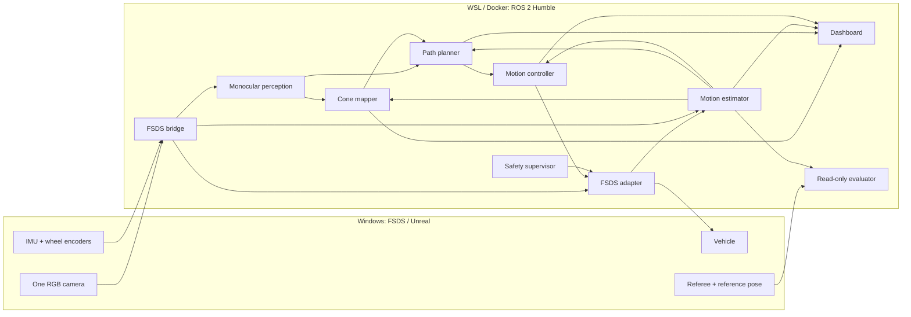

# Architecture

**16 September 2026 · FSDS monocular profile · C++ driving runtime**

This describes what runs today. [Parameters](fsd_ws/src/fsd_cpp/config/fsds_params.yaml)
and [message definitions](fsd_ws/src/fsd_msgs/msg) are authoritative. The Python
driving nodes are older reference implementations, not behaviorally equivalent.

## 1. Deployment and data flow



Heartbeat, command and pose checks feed the supervisor; individual monitoring
edges are omitted for readability. Evaluation has no feedback connection to
autonomy. Each C++ node is a separate process with `rclcpp::spin`. There is no
verified real-time scheduler or composed zero-copy pipeline. CPU OpenCV is the
tested perception path; optional CUDA execution remains unvalidated.

## 2. Monocular perception

[stereo_cone_node.cpp](fsd_ws/src/fsd_cpp/src/stereo_cone_node.cpp) retains its
historical name. `mono_only: true`, with no extra camera topics, means one input.

1. Convert the image to BGR and threshold blue, yellow and orange in HSV.
2. Remove sky before contour extraction and close small gaps with a 3 × 3 kernel.
3. Merge aligned vertical color fragments across white cone stripes.
4. Reject small, implausibly shaped, truncated or physically oversized candidates.
5. Range from the ground-contact row using calibrated flat-ground geometry.
6. Publish cone coordinates in `base_link`, preserving the image timestamp.

For the level FSDS camera:

```text
depth = fy × camera_ground_height / (bbox_bottom − cy)
left  = −(bbox_center_x − cx) × depth / fx
forward_in_base = camera_offset_x + depth
```

Effective ground height is 0.8 m. Absolute camera RPC elevation includes a
different simulator origin and must not replace that calibration. Intrinsics,
resolution, horizon and mount geometry must stay consistent.

Depth uncertainty is a heuristic, not a calibrated confidence guarantee.
Published detection confidence is fixed at **0.8**, not measured 80% accuracy.
The published z value represents approximately the box center, not the cone
foot; mapping and planning operate in planar x/y.

With ground height zero, a known-cone-height monocular formula is available
instead. Optional stereo matching and yawed cameras also exist, but neither is
active in FSDS. No LiDAR or trained detector is used.

Limits include exposure/lighting, blur, partial occlusion, same-color objects,
slopes and pitch/roll. Camera Info does not dynamically update intrinsics.
Real Pi-camera calibration and distortion handling still need integration.

## 3. Motion estimation and clocks

The [adapter](fsd_ws/src/fsd_cpp/src/fsds_adapter_node.cpp) derives angular speed
from wheel rotation increments and timestamps, handles wrap and applies 0.06 s
smoothing. Front wheels are projected by steering angle. The
[estimator](fsd_ws/src/fsd_cpp/src/state_estimation_node.cpp) uses their mean
with a 0.18 m effective radius, avoiding driven-rear-wheel spin.

On the loaded test host, raw FSDS physics-time RPM integrated over wall time
substantially overestimated distance. Encoder increments better preserve
displacement when physics runs slower than real time. This is a simulator
adaptation, not a calibrated real-car model.

Yaw uses valid IMU orientation relative to startup, falling back to gyro
integration when orientation becomes stale. Position integrates in 2D at a
requested 50 Hz. Covariance grows heuristically with distance.
This is **dead reckoning, not an EKF or validated visual-inertial SLAM**.

Map pose correction exists but is disabled in mapper and estimator. Global
position/map drift therefore accumulates. Very low simulated heading error
cannot be transferred to a physical camera/IMU system.

## 4. Cone mapping and track knowledge

[cone_mapping_node.cpp](fsd_ws/src/fsd_cpp/src/cone_mapping_node.cpp) queries a
timestamped pose buffer to place observations into `odom`. Spatial-grid
association searches confirmed landmarks, then tentative candidates. Distance
gates scale with depth uncertainty. Scalar Kalman-style landmark updates fuse
positions; votes determine color. Association is proximity-based, not a
globally optimal or color-locked match.

Three sightings confirm a landmark. Tentative candidates expire after 1.5 s;
confirmed entries persist for the run. Blue implies LEFT, yellow RIGHT,
regardless of the cone's observed side relative to the car. Orange/unknown
landmarks retain side votes.

The map is built in memory. No robust map reload, global bundle adjustment or
validated relocalization is provided. The two clean recordings ended with 208
and 248 confirmed entries versus 196 reference cones: duplicate/drift errors
remain.

Lap knowledge comes from estimated motion crossing the startup region with
distance/direction guards. `loop_closed` means a crossing was inferred, **not**
that SLAM corrected the map. Referee lap completion is scored separately.

## 5. Local planning and recovery

[path_planning_node.cpp](fsd_ws/src/fsd_cpp/src/path_planning_node.cpp) starts in
`MODE_EXPLORE`: online discovery while driving, not a separate mandatory
exploration lap. There is no preloaded route.

A 3 s local cone cache bridges brief camera dropouts, using image-time poses and
preferring lower-uncertainty observations. Old cones expire. On the first lap,
loss of local geometry cannot fall back to the entire accumulated map.

The planner chains blue and yellow boundaries independently. With both edges,
it forms midpoint geometry. With one edge, it offsets inward by half the
assumed width (fallback 3.5 m). Color, not observed lateral sign, controls this
offset, preventing reversed recovery when the car crosses a boundary.

Delaunay opposite-boundary midpoints and ordered-chain search provide fallback
geometry. Smoothing and Catmull–Rom interpolation generate roughly 0.5 m-spaced
points with heading and curvature.

No corridor means a **fresh empty path and zero speed limit**, not a re-stamped
old path. The controller brakes without latching EBS and can resume when valid
geometry returns. This does not guarantee recovery from arbitrary off-track
positions or beyond the camera's field of view.

## 6. Racing line and objects

After an estimated lap crossing, `MODE_KNOWN` permits a closed corridor and
constrained iterative racing-line optimization. A valid known-track path can
request 10 m/s; local fallback remains capped at 2.5 m/s. Curvature and stopping
distance further constrain the controller.

This is a heuristic geometric racing line, not a proven minimum-time route.
Accumulated map drift and closed-track reconstruction require more validation.
Knowing the track flag alone does not prove safe high-speed operation.

Repeated cone-like landmarks inside the corridor can trigger lateral avoidance
or a zero-speed blockage response. Large orange cones are ignored as obstacles
in this profile. There is no general object detector, pedestrian detector,
moving-object tracker or validated dynamic-obstacle avoidance.

## 7. Control and simulator actuation

[motion_control_node.cpp](fsd_ws/src/fsd_cpp/src/motion_control_node.cpp) runs
at a requested 50 Hz. Its velocity profile combines curvature limits, backward
braking and forward acceleration passes. Pure Pursuit uses a speed-dependent
2–8 m lookahead; PI speed control requests propulsion. The observed-path stopping
limit reserves 0.3 s reaction time and 1 m distance. Upward cap changes ramp
from rest; downward limits apply immediately.

FSDS tuning: 1.55 m wheelbase, ±0.35 rad internal steering, 6 m/s² lateral and
braking limits, 3 m/s² acceleration, 30 Nm propulsion scaling. These are
software settings, not measured hardware dynamics. The adapter normalizes the
steering/torque commands to simulator controls. Its reported steering echoes
the command; it is not measured tire-angle feedback. Temperature/pressure
fields are not simulated hardware measurements.

## 8. Safety behavior and gaps

| Condition | Response |
|---|---|
| Invalid/absent path, source stamp older than 0.5 s, endpoint behind car | Controlled braking, DEGRADED; can resume |
| Previously active path publisher absent >2 s | Controller emergency command |
| Odometry reception stale >0.2 s | Controller emergency command |
| IMU or wheels stale >0.3 s | Estimator stops odometry and reports ERROR |
| Required heartbeat missing >0.5 s after 5 s startup grace | Supervisor latches EBS |
| Node ERROR, nonfinite command/pose, steering violation, >1 m pose jump | Supervisor latches EBS |
| Moving >0.5 m/s with zero confirmed cones >8 s | Supervisor latches EBS |
| EBS latched | Adapter full braking on control callbacks; restart needed |

The supervisor emits a 10 Hz boolean keepalive. **The FSDS adapter does not
enforce keepalive freshness or an independent command watchdog**; its brake
response is sent on control callbacks. Controller/bridge/supervisor death needs
dedicated failure-injection testing. Multiple checks on one computer are not
independent certified braking channels.

There is no validated physical E-stop, brake actuator, steering actuator, CAN
watchdog or competition safety case in this release. Auto-GO is simulation-only.
Never use this launch profile on an actuated real car.

## 9. Observability

The dashboard shows estimated map/path/pose, control, lap estimates and health.
It does not show ground-truth accuracy or actual host CPU/GPU metrics.
Recording/replay controls are diagnostic; never replay into a live control domain.
HTTP binds all interfaces without authentication: trusted local networks only.

The bounded evaluator independently records referee, reference pose, estimated
state, paths, controls and EBS. [Validation](docs/validation.md) defines the
limits of those measurements.
