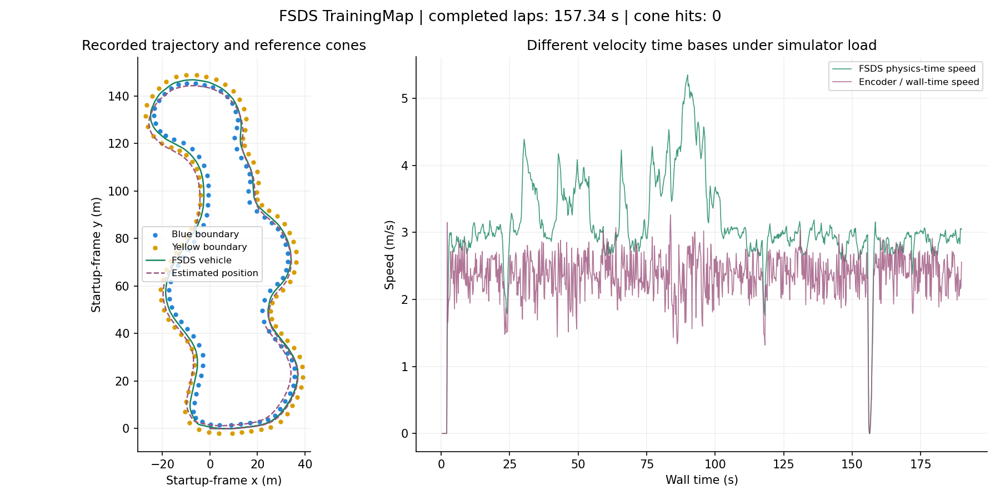

# Validation and accuracy record

**Reviewed 16 September 2026. Driving implementation: `79502e9`.**

The current monocular stack has completed clean FSDS laps, but does **not** yet
complete them reliably under all tested host conditions. Successful runs and
failures are retained below. None of these results establishes race readiness,
physical vehicle safety or competition qualification.

## 1. End-to-end FSDS trials

All listed runs used TrainingMap. Times below are the FSDS referee's lap times.
Recording windows include startup and, when applicable, part of a following lap.

| Local run ID | Window | Referee laps / lap time | Down-or-out cones | Result |
|---|---:|---|---:|---|
| `20260916_123304` | 100 s | 0 | 8 | Failed baseline before encoder/perception correction |
| `20260916_124717` | 220 s | 1 / **151.362 s** | **0** | Clean fresh-spawn lap |
| `20260916_125234` | 190 s | 1 / **157.341 s** | **0** | Clean fresh-spawn lap; brief automatic corridor recovery |
| `20260916_125713` | 190 s | 0 | 0 | Failed repeat: stale IMU/wheels triggered EBS around 122 s |
| `20260916_212359` | 100 s | 0 | 0 | Profiling run: same stale-input EBS around 32 s |

The three dedicated post-fix lap trials therefore contain two successes and one
failure. The later profiling run is a separate, shorter trial that also failed.
Do not describe this as “100% reliable” or as an estimated population success
probability. Referee cone-hit counters, not only controller output, determine
collision-related acceptance.

The failed repeat and profiling run logged:

```text
EBS TRIGGERED: node state_estimation reports ERROR: IMU or wheel data stale
```

The supervisory brake latch did its intended job. Its underlying input-timing
failure remains unresolved. A zero controller emergency flag alone is not
evidence of no EBS; the independent supervisor flag must also be checked.



This plot is generated from run `20260916_125234`, not a synthetic animation.
Green is simulator reference; dashed purple is estimated position. The dots are
reference boundary cones, **not** the estimated map. Ground truth is used only
for this offline comparison. The full 190 s recording includes a partial next lap.

## 2. Pose and boundary measurements

| Measurement | Clean run 1 | Clean run 2 | Failed repeat 3 | Profiling run |
|---|---:|---:|---:|---:|
| Reference distance over recording | 541.60 m | 452.50 m | 285.23 m | 59.32 m |
| Maximum accumulated position error | 5.241 m | 3.544 m | 15.314 m | 8.013 m |
| Final position error | 4.268 m | 2.368 m | 13.127 m | 8.013 m |
| Median absolute heading error | 0.002° | 0.002° | 0.002° | 0.003° |
| Minimum sampled body clearance | 0.305 m | 0.340 m | 0.305 m | 0.418 m |
| Sampled body departures | 0 | 0 | 0 | 0 |
| Final confirmed map entries | 208 | 248 | 195 | 75 |

Position error is Euclidean x/y error between estimated and reference odometry
in startup-aligned frames, paired from the latest received values near 5 Hz.
It is not time-interpolated ground-truth alignment, local steering error or a
precisely surveyed world-position error. Heading uses wrapped yaw difference.
The simulated IMU supplies orientation; its excellent heading agreement does
not validate physical IMU performance.

Clearance compares the reference vehicle with straight segments joining the
reference blue/yellow boundaries, using a 1.8 × 1.0 m box and sampled poses.
The algorithm assumes the reference cones are ordered along each boundary.
It is not continuous collision checking, does not fully model displaced cones
or curved boundaries, and cannot prove zero departures between samples.
[FSDS vehicle dimensions](https://fs-driverless.github.io/Formula-Student-Driverless-Simulator/v2.0.1/vehicle_model/).

Reference geometry contains 196 cones (96 blue, 96 yellow, four large orange).
Map count is **not** detection recall: duplicates and drift can inflate it.
No complete landmark-to-reference association accuracy/RMSE has been measured.

## 3. Perception accuracy: known and unknown

Verified built-node cases reject synthetic sky/blue road backgrounds, detect a
pale striped yellow cone, and detect both boundaries in a locally captured
stationary FSDS start image. Those are regression examples, not a representative
labeled dataset.

The captured-frame check requires a blue cone near (3.88, 1.39) m within
0.5 m longitudinal / 0.3 m lateral tolerance, and yellow near (9.44, −1.97) m
within 0.8 m / 0.4 m. Passing these tolerances does not establish that error
bound at every distance, turn or lighting condition.

**No cone precision, recall, mAP, false-positive-per-frame rate or held-out
depth-error distribution is available.** Published confidence is a fixed
algorithm value of 0.8, not an accuracy percentage.

The FSDS profile assumes flat ground and a level camera. Slopes, braking pitch,
roll, real Pi-camera distortion, exposure changes, blur and physical cone
appearance remain unvalidated. Camera mount observations made before correcting
negative Z are invalid evidence for current perception performance.

## 4. Speed and time-base limitations

The first-lap planner requests 2.5 m/s in the estimator/controller time base.
Clean-run median moving FSDS physics-time speeds were approximately 2.94 and
2.98 m/s. These are not directly comparable with a real vehicle's speed budget.

In the failed 100 s baseline, integrating physics-time reference speed over
wall time gave 100.62 m while reference position travelled 50.50 m. Old estimated
distance reached 94.83 m and maximum position error 38.35 m. Encoder rotation
increments measured 47.65 m at a 0.18 m radius, motivating displacement-derived
speed instead of raw RPM integration.

Later sensor gaps still cause drift and stops. Isolated physical-speed spikes
in slow simulation are not proof of fast controlled driving. No full-speed,
known-track clean lap or optimal lap-time claim is supported.

## 5. Changes behind the improved laps

- Corrected the camera from underground negative Z to +0.8 m.
- Unified CPU/CUDA HSV constants; separated blue cones from bluish asphalt and
  retained pale yellow.
- Masked sky before contours, merged cone stripe fragments and applied calibrated
  ground-foot projection/physical-size checks.
- Used front-wheel rotation increments and IMU heading to reduce wheelspin/time-base drift.
- Kept short-lived local geometry and color-defined inward recovery; removed
  first-lap whole-map fallback on lost perception.
- Published empty paths on missing geometry; preserved watchdogs for dead inputs.
- Fixed the startup cap ramp and reduced longitudinal gain oscillation.
- Replaced repeated ROS CLI status subscriptions with lightweight dashboard reads.

CUDA execution was not tested even though threshold source is shared.

## 6. Test layers and coverage

| Layer | What it checks | What it does not establish |
|---|---|---|
| Standalone C++ | Extracted geometry/mapping helpers and synthetic cases | Full ROS lifecycle or real track reliability |
| Built-node regression | Actual C++ perception/planner/controller/estimator/adapter behavior in domain 91 | Complete bridge/FSDS system, Jetson or real actuators |
| Bounded FSDS evaluation | Referee laps/cones, pose, map/path/control, both EBS flags | Continuous collision proof or unseen environments |
| Profiling | Host/process utilization under recorded conditions | Worst-case timing, moving-lap budget or embedded performance |
| GitHub CI | C++ helpers, Python/Bash syntax | FSDS execution or vehicle certification |

Built-node regression cases include:

- Blue-left/yellow-right recovery from across an edge.
- Fresh empty corridor causes controlled braking, then automatic resumption.
- Startup acceleration ramp and dead-planner EBS.
- Front-wheel estimate and IMU-relative heading; driven-rear-wheel spin exclusion.
- Encoder wrap and independence from raw physics-time RPM.
- Synthetic sky/asphalt rejection and pale striped yellow detection.
- Optional captured start-frame geometric checks.

The optional frame is local, not bundled in Git. Source tests have passed;
the compiled-node suite is run after workspace build. CI runs no GPU/Jetson tests.

## 7. Reproduce acceptance

From a sourced ROS environment at `fsd_ws`:

```bash
python3 tools/test_runtime.py
python3 tools/test_runtime.py --frame artifacts/calibration/camera_00.png
python3 tools/summarize_fsds.py demo_logs/latest/evaluation.json \
  --reference artifacts/reference.json --require-clean-lap
```

Choose the optional captured-frame command only if that file exists.
`--require-clean-lap` exits nonzero unless a new referee lap completes without
an increased cone-hit count, controller/supervisor EBS, or absent supervisor
telemetry. With reference geometry it additionally rejects sampled body departures.

The acceptance check was exercised against a clean recording (pass) and the
failed baseline/repeat (reject). Always preserve the exact run ID and use
matching reference geometry. Raw JSON/PNGs stay local under ignored
`artifacts` and `demo_logs`; the tables above are the versioned handoff summary.

Remaining acceptance gates: [roadmap](roadmap.md).
